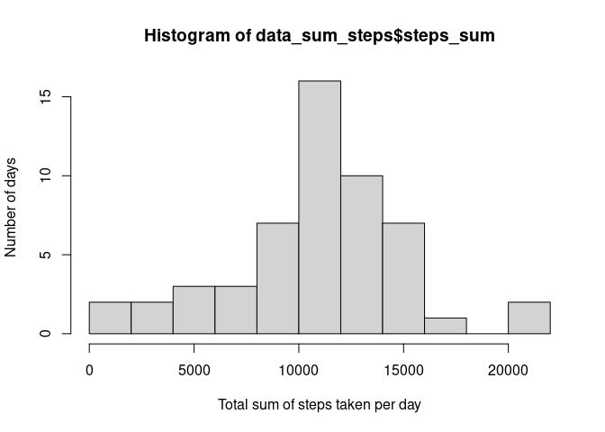
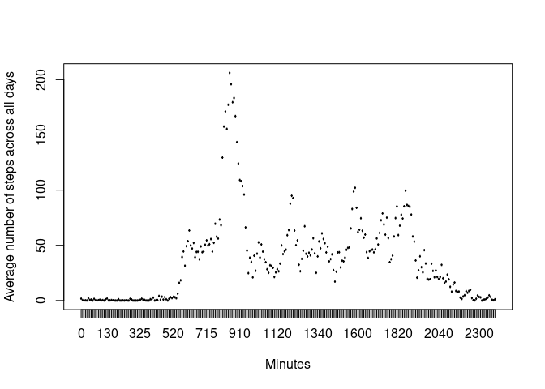
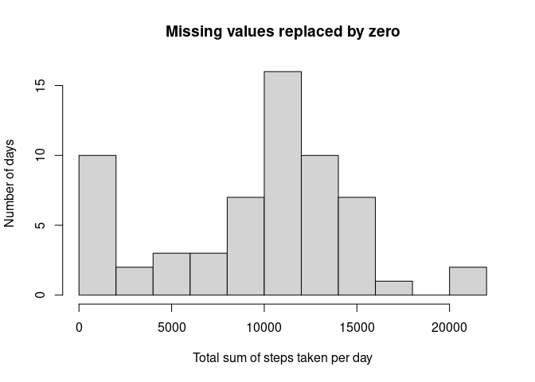
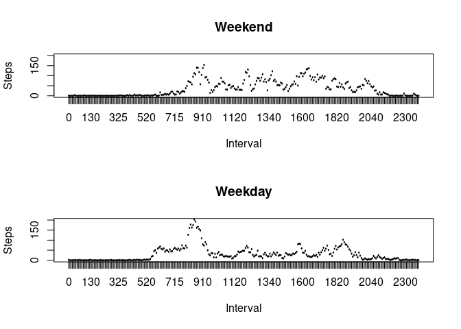

## Loading and preprocessing the data

First, needed libraries are loaded and the output/message is not printed.

```r
library(dplyr)
```

The raw data is loaded into the variable `data_act` and then the date column is converted into the Date-format.

```r
data_act <- read.csv("activity.csv")
data_act$date <- as.Date(data_act$date, "%Y-%m-%d")
data_act$date <- as.factor(data_act$date)
data_act$interval <- as.factor(data_act$interval)
```

## What is mean total number of steps taken per day?

As the first step, the total number of steps taken per day is calculated.

```r
data_grouped <- group_by(data_act, date)
data_sum_steps <- summarise(data_grouped, steps_sum = sum(steps))
```

A histogram will be generated to have an idea about the distribution of the total number of steps on how many days.

```r
hist(data_sum_steps$steps_sum, breaks = 10, xlab = "Total sum of steps taken per day", ylab = "Number of days")
```

<!-- -->

Now, we want to calculate the `mean()` and `median()` of the total number of steps taken each day.

```r
mean(data_sum_steps$steps_sum, na.rm = TRUE)
```

```
## [1] 10766.19
```

```r
median(data_sum_steps$steps_sum, na.rm = TRUE)
```

```
## [1] 10765
```

Due to the generated output we have calculated a mean value of 1.0766189\times 10^{4} steps and a median of 10765 steps.

## What is the average daily activity pattern?

As the first step, we are sorting the data by `group_by()` and then determing the `mean()` of each 5-minute interval.

```r
data_grouped_2 <- group_by(data_act, interval)
data_avg_steps <- summarise(data_grouped_2, steps_avg = mean(steps, na.rm = TRUE))
data_avg_steps
```

```
## # A tibble: 288 x 2
##    interval steps_avg
##    <fct>        <dbl>
##  1 0           1.72  
##  2 5           0.340 
##  3 10          0.132 
##  4 15          0.151 
##  5 20          0.0755
##  6 25          2.09  
##  7 30          0.528 
##  8 35          0.868 
##  9 40          0     
## 10 45          1.47  
## # … with 278 more rows
```

Now, the data `data_avg_steps` can be plotted.

```r
with(data_avg_steps, plot(interval, steps_avg, xlab = "Minutes", ylab = "Average number of steps across all days", type = "1"))
```

<!-- -->

To get the 5-minute interval, which contains on average the maximum number of steps, the data is sorted in descended order and the first entry of the resulting table is the wanted value.

```r
data_avg_steps_sort <- arrange(data_avg_steps, desc(steps_avg))
data_avg_steps_sort[1,1]
```

```
## # A tibble: 1 x 1
##   interval
##   <fct>   
## 1 835
```

Therefore, we get 835 as the 5-minute interval with the maximum number of steps.

## Imputing missing values

To evaluate the number of missing value, we first search for missing values via the `is.na()` function and then take the sum of all the found `TRUE` statements.

```r
sum(is.na(data_act$steps))
```

```
## [1] 2304
```

Hence, we found out, that 2304 missing values are in the dataset.

To replace `NA` in the dataset, we choose the value `0` which has been put on all positions where the `is.na()` function found a missing value. Therefore, we have directly a new dataset.


```r
data_act[is.na(data_act)] <- 0
```

Now, we create the same histogram and again, calculate the `mean()` and `median()` of the new dataset with the replaced missing values.


```r
data_grouped <- group_by(data_act, date)
data_sum_steps <- summarise(data_grouped, steps_sum = sum(steps))
hist(data_sum_steps$steps_sum, breaks = 10, xlab = "Total sum of steps taken per day", ylab = "Number of days", main = "Missing values replaced by zero")
```

<!-- -->

```r
mean(data_sum_steps$steps_sum, na.rm = TRUE)
```

```
## [1] 9354.23
```

```r
median(data_sum_steps$steps_sum, na.rm = TRUE)
```

```
## [1] 10395
```
Due to the generated output we have calculated a mean value of 9354.2295082 steps and a median of 1.0395\times 10^{4} steps. These numbers are lower as the previous calculated values since the divider for the determination is higher, and therefore the resulting number is lower. By imputing missing data the participated bias can be reduced. This is valid method in statistics and several methods can be applied.

## Are there differences in activity patterns between weekdays and weekends?

First, we need to identity the weekdays of the data by applying the `weekdays()` function to the date column. Then, the weekend days are identified by `Samstag` and `Sonntag` and replaced by `Weekend`. All the other days are replaced by `Weekday` and the new column is factorized.

```r
data_act_wd_we <- mutate(data_act, wd_we = weekdays(as.Date(data_act$date, "%Y-%m-%d")))
data_act_wd_we$wd_we = ifelse(data_act_wd_we$wd_we %in% c('Samstag', 'Sonntag'), 'Weekend', 'Weekday')
data_act_wd_we$wd_we <- as.factor(data_act_wd_we$wd_we)
```

For the required histograms, we calculate the average interval steps based on whether it is a `Weekday` or a `Weekend` and then split the data frame. With the splited data the required plot can be generated.


```r
data_grouped_3 <- group_by(data_act_wd_we, interval, wd_we)
data_grouped_avg_2 <- summarise(data_grouped_3, steps_avg = mean(steps, na.rm = TRUE))
data_split <- split(data_grouped_avg_2, f = data_grouped_avg_2$wd_we)
data_wd <- as.data.frame(data_split[1])
data_we <- as.data.frame(data_split[2])
par(mfrow=c(2,1))
with(data_we, plot(Weekend.interval, Weekend.steps_avg, xlab = "Interval", ylab = "Steps", type = "1", main = "Weekend", ylim = c(0,200)))
with(data_wd, plot(Weekday.interval, Weekday.steps_avg, xlab = "Interval", ylab = "Steps", type = "1", main = "Weekday", ylim = c(0,200)))
```

<!-- -->

The plots show clearly that there is a difference between activities during weekday and weekend. There seems to be more activity durung the weekend.
